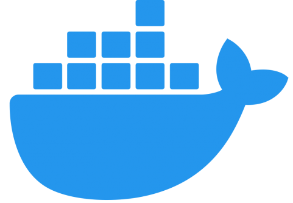
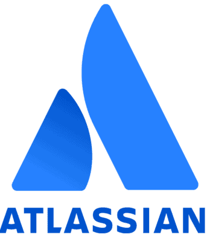

## GitHub Stats

## My stack

 
Solid experience with Linux administration

 
Experience with Cloud solutions

 
Proficient with scripting

 
Work with Git and build of VCS workflows

 
Understanding of containerization/virtualization

 
Work with orchestration tools

 
Take advantage of CI pipelines

 
Experience in building IaaC

 
A lot of experience in monitoring and maintaining

 
Work with SQL Databases and DB integrations

 
Wrote documentation and playbooks

 
Strong hands-on experience with varied types (classes) of telecommunications, server and network equipment

 
 
Knowledge of stacks OSI, TCP/IP and network protocols

 
 
Good knowledge of Software Development Life Cycle

## Connect with me

